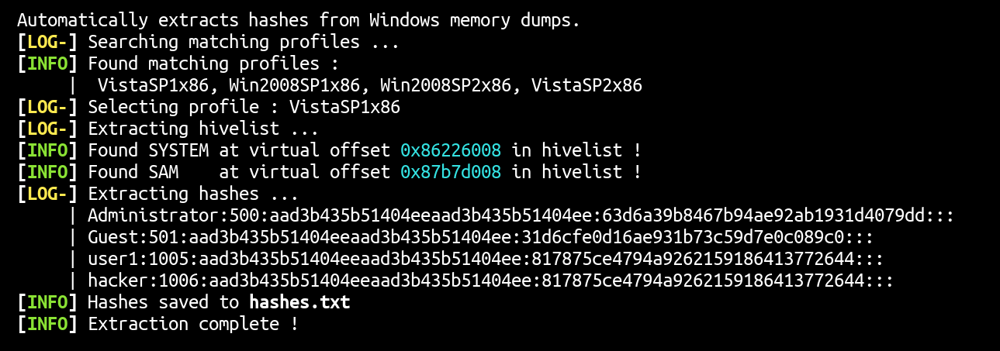

# Hashes-Harvester

Automatically extracts NTLM hashes from Windows memory dumps.



## Usage

```
Hashes-Harvester: Automatically extracts NTLM hashes from Windows memory dumps.
Usage : winpass.sh MEMORYFILE
```

## Contributing

Pull requests are welcome. Feel free to open an issue if you want to add other features.