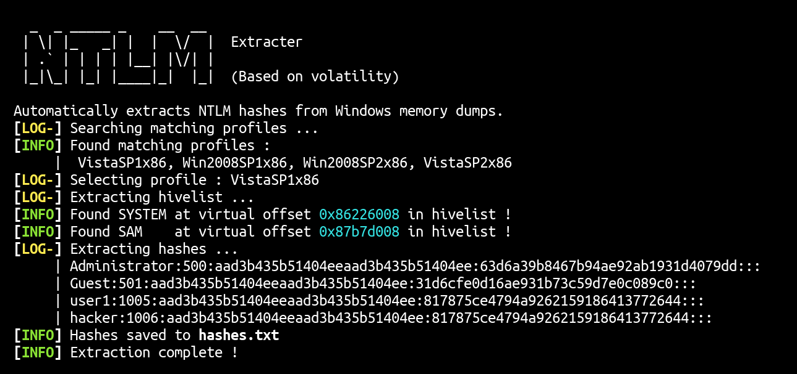

# volatility-ntlm-extractor

Automatically extracts NTLM hashes from Windows memory dumps.



## Usage

```
  _  _ _____ _    __  __  
 | \| |_   _| |  |  \/  |  Extracter
 | .` | | | | |__| |\/| |
 |_|\_| |_| |____|_|  |_|  (Based on volatility)

Automatically extracts NTLM hashes from Windows memory dumps.
Usage : winpass.sh MEMORYFILE
```
